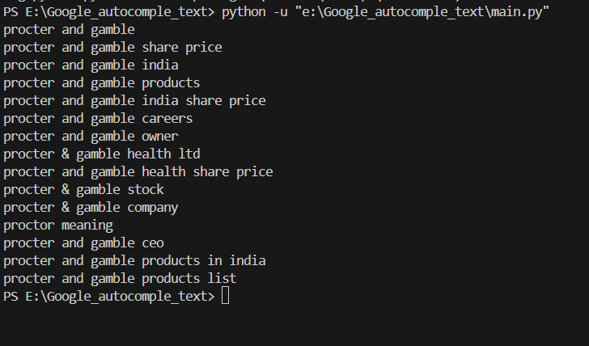
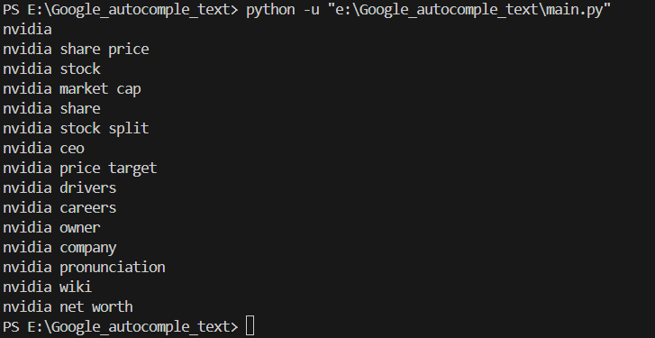

# GOOGLE_AUTOCOMPLETE_TEXT
Google Autocomplete is a Python-based project that mimics the functionality of Google's search autocomplete feature. It predicts and displays search query suggestions in real-time as users type, providing a smooth and intuitive search experience.

